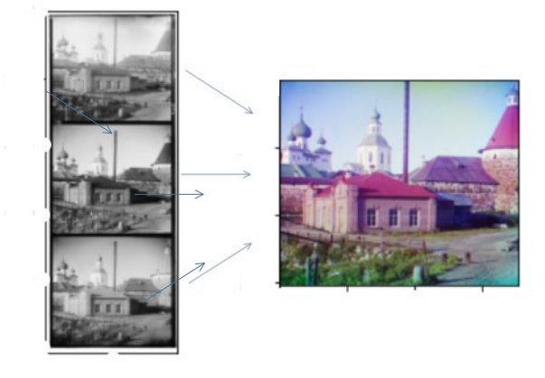

# Versions of libraries
  <table>
  <tr>  
    <td> Python </td>
    <td> 3.5 </td>
    </tr>
    <tr>
      <td> NumPy</td>
      <td> 1.19.5 </td>
    </tr>
    <tr>
      <td> PIL </td>
      <td> 8.0.1 </td>
     </tr>
    <tr>
      <td> OpenCV </td>
      <td> 4.0.1 </td>
  </tr>
      <tr>
      <td> Matplotlib </td>
      <td> 3.3.3 </td>
    </tr>
  </table>
# DigitizedProkudinGorskii
An example of digitized prokudin gorskii images by using OpenCV lib &amp; Python.

## Background-Information

Sergei Mikhailovich Prokudin-Gorskii (1863-1944) [1] a Russian chemist and photographer, is
considered as a Pioneer of color photography. Convinced, as early as 1907, that color
photography wasthe wave of the future, with Tzar's special permission, he traveled across the
Russian Empire and tookcolor photographs of people, buildings, landscapes, railroads,
bridges... thousands of color pictures!His idea was simple: record three exposures of every
scene onto a glass plate using a red, a green, anda blue filter. He even envisioned special
projectors to be installed in "multimedia" classrooms all acrossRussia where the children would
be able to learn about their country.
## Overview: 
My purpose is digitized Prokudin-Gorskii glass plate images. Plate images have all RGB
channels in one whole image. Primarily goal is create one rgb image from the given plate
image

## Approach:

Images are ordered Blue,Green,Red. Firstly I separated the images ,keeping in my mind that the
channels order were b, g, r. Firstly i applied alignment with SDD[2] and colorized to image. And
result is not satisfy me so i decided apply another alignment score calculating method,NCC[2].
And then i calculate alignment approachs for NCC[2] and SDD[2]. I choose which one is high
total score. After that combined green and red channels to blue one. I mean i used two different
calculating method for alignment. After that i combined all channels. I saw that images had
border and because of that my images channels can’t fit properly. To improve my approach, i
croped border as vertically and horizontally. I used two method to improve my approach :

<ol>
<li>  Choose better method for calculating alignment points
  </li>
<li>  Crop border
  </li>
</ol>

In conclusion my research showed that my methods 6/9 working well. Because of border images
doesn’t fit to each other well. May be different techniques to find suitable points for alignments
can be better like RANSAC. Plate images and combined images are shown is a plot in Jupyter
notebook file.

## REFERENCES

<ol>
<li> [URL]http://en.wikipedia.org/wiki/Prokudin-Gorskii
  </li>
<li>  Szeliski Richard, (2010). Computer Vision: Algorithms and Applications (pp. 384-387)
  </li>
</ol>
