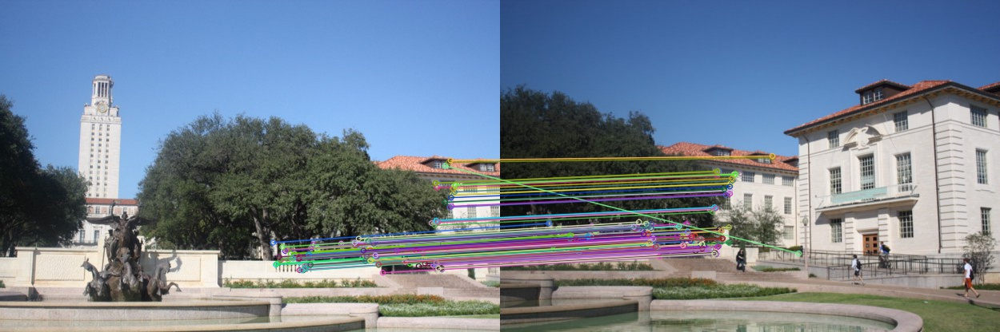

# Versions of libraries
  <table>
  <tr>  
    <td> Python </td>
    <td> 3.5 </td>
    </tr>
    <tr>
      <td> NumPy</td>
      <td> 1.19.5 </td>
    </tr>
    <tr>
      <td> OpenCV </td>
      <td> 4.0.1 </td>
  </tr>
  </table>
  
# ImageStitching
Image stitching from scratch in python programming language and by helping OpenCV lib. If you use any file, don't forget cite.

## Introduction

In this repo, you will see what is image stitching, necessary steps for image stitching, outputs
of each step.

## 1. What is Image Stitching?

Image stitching or panorama is combining two image which have similar points or features. It
can be useful when we want to wider perspective or want to merge two similar image.

## 2. Problem Definition

We want to merge two image according to similar points or features. Other different pixel
values and objects etc. could be problem. So we need to apply some steps for image stitching.
Following next section you will see my methods to solve problem and outputs of each step.

## 3. Using Methods to Solve

First of all, we need to two image which have similar points. Loading these images we need to
find similar features/points. For that there are some different techniques such as SIFT,ORB
etc. We learned SIFT in class so i want to use that. However opencv library does not support
anymore, i should downgrade opencv version. But i did not, instead of that i decided different
technique for feature detection. I used Oriented Fast and Rotated Brief (ORB) in OpenCV
library for feature detection. After created ORB object, i used this for calculate keypoints and
descriptors in the image. And then i calculated all matches. According to defining ratio, i
eliminate some matches. So that i found better matches points and distances. After that i
apply RANSAC method to calculate Homography Matrix. I apply warp using with Homography
Matrix. And finally i warp image as a reference another image and stitched them.

## 4. Outputs of solving steps:

Image stitching can be splitted many sub-steps. However mainly there are some several steps like
these:
<ul>
 <li> Find keypoints and descriptors </li>
 <li> Find matches between two images.</li>
 <li> Calculate distances and choose best options.</li>
 <li> Define best matches.</li>
 <li> Find homography and warp an image to another.</li>
 <li> Stitch images.</li>
</ul>

<i>  1. Original Left Image     </i>

<i>    2. Original Right Image   </i>

<i>  3. Keypoints and Descriptors for Left Image     </i>

<i>  4. Keypoints and Descriptors for Right Image    </i>

<i>   5. All Matches   </i>

 
<i>   6. Calculate and Find Best Matches   </i>

 
<i>    7. Final/Stitched Image   </i>

<b>REFERENCES</b>
<ol>
<li> [URL] https://en.wikipedia.org/wiki/Image_stitching  </li>
<li> [URL] https://docs.opencv.org/master/dc/dc3/tutorial_py_matcher.html  </li>
<li> [URL] http://datahacker.rs/004-opencv-projects-how-to-extract-features-from-the-image-in-python/  </li>
<li> [URL] http://datahacker.rs/005-how-to-create-a-panorama-image-using-opencv-with-python/  </li>
</ol>
